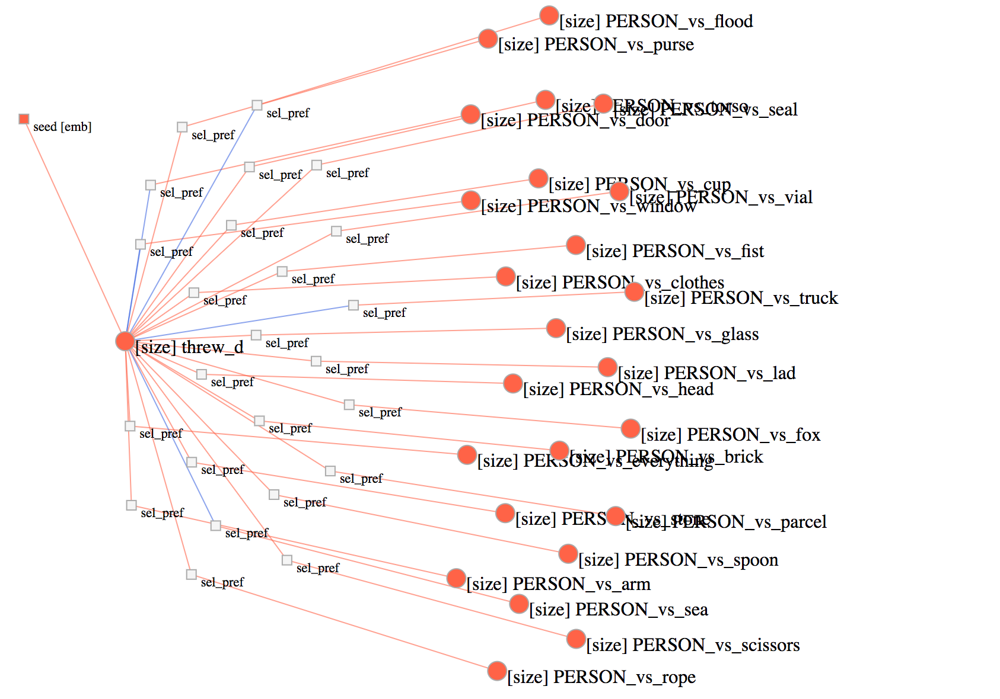

# py-factorgraph

[](https://github.com/mbforbes/py-factorgraph/actions)
[](https://coveralls.io/github/mbforbes/py-factorgraph?branch=master)
[](https://github.com/mbforbes/py-factorgraph/blob/master/LICENSE.txt)

This is a tiny python library that allows you to build factor graphs and run
the (loopy) belief propagation algorithm with ease. It depends only on
[`numpy`](http://www.numpy.org/).

## Installation

```bash
pip install factorgraph
```

## Example

Code (found in `examples/simplegraph.py`):

```python
import numpy as np
import factorgraph as fg

# Make an empty graph
g = fg.Graph()

# Add some discrete random variables (RVs)
g.rv('a', 2)
g.rv('b', 3)

# Add some factors, unary and binary
g.factor(['a'], potential=np.array([0.3, 0.7]))
g.factor(['b', 'a'], potential=np.array([
        [0.2, 0.8],
        [0.4, 0.6],
        [0.1, 0.9],
]))

# Run (loopy) belief propagation (LBP)
iters, converged = g.lbp(normalize=True)
print('LBP ran for %d iterations. Converged = %r' % (iters, converged))
print()

# Print out the final messages from LBP
g.print_messages()
print()

# Print out the final marginals
g.print_rv_marginals(normalize=True)
```

Output:

```
LBP ran for 3 iterations. Converged = True

Current outgoing messages:
	b -> f(b, a) 	[ 0.33333333  0.33333333  0.33333333]
	f(a) -> a 	[ 0.3  0.7]
	a -> f(a) 	[ 0.23333333  0.76666667]
	a -> f(b, a) 	[ 0.3  0.7]
	f(b, a) -> b 	[ 0.34065934  0.2967033   0.36263736]
	f(b, a) -> a 	[ 0.23333333  0.76666667]

Marginals for RVs (normalized):
a
	 0 	 0.11538461538461539
	 1 	 0.8846153846153845
b
	 0 	 0.34065934065934067
	 1 	 0.29670329670329676
	 2 	 0.3626373626373626
```

## Visualization

You can use [`factorgraph-viz`](https://github.com/mbforbes/factorgraph-viz) to
visualize factor graphs interactively in your web browser.

[](https://github.com/mbforbes/factorgraph-viz)

## Tests

```bash
pip install pytest-cov coveralls
py.test --cov=factorgraph tests/
```

## Projects using `py-factorgraph`

_Open an issue or send a PR if you'd like your project listed here._

- [verbphysics](https://github.com/uwnlp/verbphysics)

## Contributing

There's plenty of low-hanging fruit to work on if you'd like to contribute to
this project. Here are some ideas:

- [ ] Unit tests
- [ ] Auto-generated python docs (what's popular these days?)
- [ ] Performance: measure bottlenecks and improve them (ideas: numba;
  parallelization for large graphs;)
- [ ] Remove or improve ctrl-C catching (the `E_STOP`)
- [ ] Cleaning up the API (essentially duplicate constructors for `RV`s and
  `Factor`s within the `Graph` code; probably should have a node superclass for
  `RV`s and `Factor`s that pulls out common code).

## Releasing

TBD: Notes for myself on how to release

- update setup.py
- ...?


## Thanks

- to Matthew R. Gormley and Jason Eisner for the [Structured Belief Propagation
  for NLP Tutorial](https://www.cs.cmu.edu/~mgormley/bp-tutorial/), which was
  extremely helpful for me in learning about factor graphs and understanding
  the sum product algorithm.

- to Ryan Lester for [pyfac](https://github.com/rdlester/pyfac), whose tests I
  used directly to test my implementation
